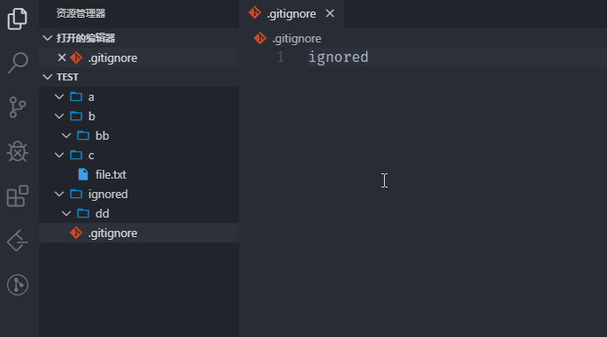

# Auto Gitkeep

Auto Gitkeep is a VS Code extension that can automatically add .gitkeep file to empty directories, so that directory hieriarchy can be preserved for git commit.

## Features

1. Insert .gitkeep file automatically as soon as a directory becomes empty.
2. Remove .gitkeep file automatically whenever a directory is populated with real files/directories.
3. Enabled automatically for git repository workspace (with a `.git` folder).
4. Can detect `.gitignore` file changes and ignore directories listed in it.
5. A simple command is provided to enable the extension for non-git-repository workspace.

## Usage

- For git repository workspace (with a `.git` folder), the extension is enabled automatically.
- For other workspace, press `F1` and run command `Gitkeep Generate` to initialize the extension.

## Extension Settings

Currently none.

<!-- Include if your extension adds any VS Code settings through the `contributes.configuration` extension point.

For example:

This extension contributes the following settings:

* `myExtension.enable`: enable/disable this extension
* `myExtension.thing`: set to `blah` to do something -->

## Known Issues

Currently none.

## Release Notes

### 1.0.0

Initial release.

